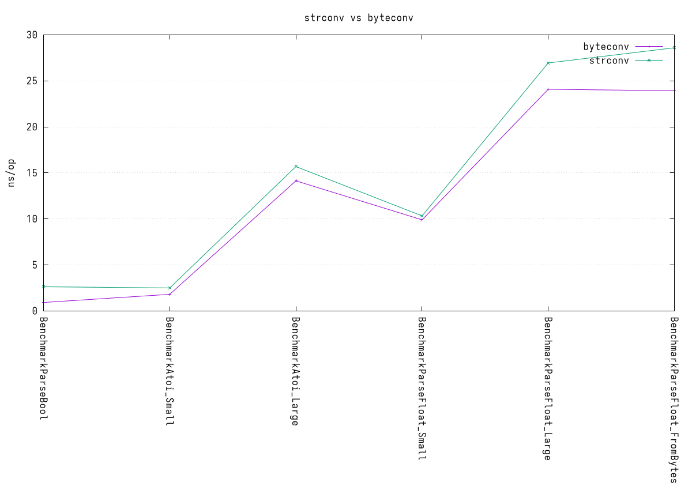

# byteconv

`byteconv` is a high-performance, zero-allocation Go library for parsing basic data types directly from byte slices (`[]byte`). 

This project is a heavily modified, zero-allocation, byte-slice-based derivative of the Go standard library's `strconv` package. Original `strconv` code is Copyright (c) 2009 The Go Authors.

## Overview

Parsing data types from `[]byte` payloads (such as those returned by network reads, database drivers, or file I/O) typically requires first casting the slice to a `string` before passing it to `strconv`. This cast results in memory allocations and overhead that can become a bottleneck in high-throughput applications. 

`byteconv` solves this problem by providing a 1-to-1 equivalent of the standard `strconv` package that operates natively on `[]byte`. It eliminates string allocations entirely while remaining highly optimized.

## Installation

```sh
go get github.com/coalaura/byteconv
```

## Usage

```go
package main

import (
	"fmt"
	"github.com/coalaura/byteconv"
)

func main() {
	data := []byte("12345")
	
	// Parse integers directly from []byte
	num, err := byteconv.Atoi(data)
	if err != nil {
		panic(err)
	}
	fmt.Println(num)

	// Parse floats natively
	floatData := []byte("3.14159")
	f, err := byteconv.ParseFloat(floatData, 64)
	if err != nil {
		panic(err)
	}
	fmt.Println(f)
	
	// Parse booleans
	boolData := []byte("true")
	b, err := byteconv.ParseBool(boolData)
	if err != nil {
	    panic(err)
	}
	fmt.Println(b)
}
```

## Performance

The entire parsing surface (e.g., `Atoi`, `ParseInt`, `ParseFloat`, `ParseBool`) achieves **0 allocs/op** and executes in just a few nanoseconds, matching or outperforming standard library equivalents without requiring string conversions.



## License

This source code is governed by a BSD-style license that can be found in the `LICENSE` file. Original logic derived from The Go Authors.
